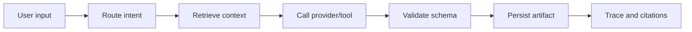

# LaserClaw

LaserClaw is a local-first **Tool-calling RAG Agent** workspace for laser experiment workflows. It combines experiment case management, global lab knowledge indexing, retrieval-augmented chat, structured artifact generation, citations, and persistent Agent traces.


> Safety note: LaserClaw does not control lasers, power supplies, translation stages, interlocks, optical tables, detectors, or any other lab hardware. Generated content is advisory draft material and must be reviewed by qualified personnel.

## What It Solves

| Problem | LaserClaw Approach |
|---|---|
| Experiment context is scattered across notes, files, and prior runs | Case-aware RAG retrieval with source citations |
| Troubleshooting is hard to reproduce | Tool-calling Agent creates structured diagnostic artifacts |
| Plans, reports, and simulation drafts are repetitive | Saved structured artifacts for plan, troubleshooting, report, and ReZonator draft |
| AI outputs are difficult to audit | Persistent task, step, tool-call, citation, and artifact records |

## Core Features

- **Case-aware Agent chat**: chat with the selected experiment case, recent conversation history, case data, and global lab knowledge.
- **RAG knowledge base**: indexes cases, text attachments, generated artifacts, and global lab documents.
- **Global lab documents**: upload shared PDFs, TXT, Markdown, CSV, JSON, or log files for all cases.
- **Optimized local retrieval**: Chinese character n-grams, phrase expansion, section-aware chunking, section metadata, and lightweight domain reranking for safety vs optics queries.
- **Tool routing**: routes user requests to chat, experiment plan, troubleshooting, report, or ReZonator draft.
- **Structured artifacts**: validates generated plan, troubleshooting, report, and resonator JSON against schemas.
- **Multi-provider support**: MockProvider, OpenAI-compatible Chat Completions, and Anthropic.
- **Traceability**: persists Agent tasks, steps, tool calls, retrieved citations, generated contents, and audit logs.
- **Bilingual UI**: English / Chinese frontend language switch.

## Agent Workflow



## Tool Routing

The app supports five intent classes:

| User intent | Tool / mode |
|---|---|
| General chat or QA | `chat` |
| Generate an experiment plan | `generate_plan` |
| Generate troubleshooting guidance | `generate_troubleshooting` |
| Generate an experiment report | `generate_report` |
| Generate a ReZonator / resonator simulation draft | `generate_resonator_draft` |

The chat API can auto-route generation requests, and direct task creation is also available through `POST /api/agent/tasks`.

## RAG and Knowledge Sources

The current RAG stack is deterministic and local. It does not require a vector database:

- tokenization: ASCII terms + Chinese character, bigram, and trigram tokens
- synonym expansion for common safety and optics terms
- section-aware chunking for headings such as `[SAF-PPE]`, `[SAF-SOP]`, `[OPT-MIRROR]`
- section metadata persisted on chunks
- lightweight domain boost for safety-related vs optics-related queries

Current synthetic evaluation documents:

- `synthetic_optical_components_catalog.pdf`: indexed as a PDF global source
- `lab_safety_manual.txt`: indexed as a TXT global source

These are **synthetic evaluation documents**. They are not real laboratory policies, operating procedures, equipment procurement data, or safety training material.

## Latest Local Benchmark

The old MockProvider / demo knowledge benchmark is deprecated. The current benchmark was run with OpenAIProvider configuration and synthetic evaluation documents.

| Item | Value |
|---|---|
| Provider | OpenAIProvider |
| Model configured | `gpt-5` |
| Base URL configured | `https://openrouter.ai/api/v1` |
| RAG retrieval queries | 50 |
| RAG answer-generation sample | 30 in the prior full eval |
| Tool routing instructions | 80 |
| Structured artifact generations | 20 |
| End-to-end Agent tasks | 10 |
| Backend tests | 120 passed |

| Metric | Result |
|---|---:|
| RAG Top-1 hit rate | 95.45% |
| RAG Top-3 hit rate | 97.73% |
| RAG MRR | 0.9678 |
| Citation correctness | 82.00% |
| Tool routing accuracy | 80.00% |
| Schema pass rate | 100.00% |
| End-to-end task success rate | 100.00% |
| Trace completeness | 100.00% |

RAG optimization improved Top-3 retrieval from 52.27% to 97.73% on the same 50-query synthetic benchmark. A 10-sample RAG answer retest was attempted after the retrieval optimization, but OpenRouter returned `403: This model is not available in your region` for the configured `gpt-5`, so answer-generation retest results are not used as model-quality evidence.

Known benchmark limitations:

- The safety manual is currently indexed as TXT, not as a PDF source.
- Evaluation is based on synthetic documents, not real laboratory data.
- Negative query rejection dropped from 100.00% to 83.33% after stronger recall; score thresholds and abstention logic are still needed.
- Token usage and cost are not exposed by the current provider wrapper.
- The local lexical retriever is not a replacement for production embeddings or reranking.

## Quick Start on Windows

```bat
Launch-LaserClaw.bat
```

The launcher:

- creates `backend/.venv` if needed
- installs backend dependencies
- installs frontend dependencies
- starts FastAPI at `127.0.0.1:8000`
- starts Vite at `127.0.0.1:5173`

Open:

- Frontend: <http://127.0.0.1:5173>
- Agent workspace: <http://127.0.0.1:5173/agent>
- API docs: <http://127.0.0.1:8000/docs>

## Manual Local Startup

Backend:

```powershell
cd backend
.\.venv\Scripts\python.exe -m pip install -r requirements.txt
.\.venv\Scripts\python.exe -m uvicorn app.main:app --host 127.0.0.1 --port 8000
```

Frontend:

```powershell
cd frontend
npm install
npm run dev -- --host 127.0.0.1 --port 5173
```

## Docker Compose

```bash
docker compose up -d --build
```

Services:

- frontend: `localhost:5173`
- backend API: `localhost:8000`
- API docs: `localhost:8000/docs`

Stop:

```bash
docker compose down
```

## Environment Variables

Create a local `.env` file for provider and runtime settings. Do not commit `.env` or API keys.

```env
AI_PROVIDER=mock

OPENAI_API_KEY=
OPENAI_MODEL=gpt-5
OPENAI_BASE_URL=https://api.openai.com/v1

ANTHROPIC_API_KEY=
ANTHROPIC_MODEL=claude-sonnet-4-5
ANTHROPIC_MAX_TOKENS=2048
ANTHROPIC_TEMPERATURE=0.2

STRICT_PROVIDER=false
REQUIRE_AUTH=false
API_KEY=

DATABASE_URL=sqlite:///./laserclaw.db
UPLOAD_DIR=./uploads
MAX_UPLOAD_SIZE=10485760
AUTO_CREATE_TABLES=true

VITE_API_URL=http://127.0.0.1:8000
```

Provider modes:

- `mock`: deterministic local demo mode
- `openai`: OpenAI-compatible Chat Completions provider
- `anthropic`: Anthropic provider

If `STRICT_PROVIDER=false`, the app can fall back to MockProvider when a real provider is unavailable. Use `STRICT_PROVIDER=true` for strict evaluation.

## Tests

```powershell
cd backend
.\.venv\Scripts\python.exe -m pytest -q
```

Current local result:

```text
120 passed
```

Useful targeted tests:

```powershell
.\.venv\Scripts\python.exe -m pytest tests\test_router.py -q
.\.venv\Scripts\python.exe -m pytest tests\test_schemas.py -q
.\.venv\Scripts\python.exe -m pytest tests\test_knowledge_agent.py -q
```

## API Surface

Core endpoints:

- `POST /api/cases`
- `GET /api/cases`
- `GET /api/cases/{case_id}`
- `POST /api/cases/{case_id}/generate-plan`
- `POST /api/cases/{case_id}/generate-troubleshooting`
- `POST /api/cases/{case_id}/generate-report`
- `POST /api/cases/{case_id}/generate-rezonator`
- `GET /api/cases/{case_id}/generated-contents`
- `POST /api/knowledge/sources/upload`
- `GET /api/knowledge/sources`
- `POST /api/knowledge/search`
- `POST /api/agent/chat`
- `POST /api/agent/tasks`
- `GET /api/agent/tasks/{task_id}`
- `GET /api/agent/tasks/{task_id}/tool-calls`

## Persistence

Important tables:

- `experiment_cases`
- `attachments`
- `knowledge_sources`
- `knowledge_chunks`
- `retrieval_runs`
- `retrieval_results`
- `agent_chat_sessions`
- `agent_chat_messages`
- `agent_tasks`
- `agent_steps`
- `agent_tool_calls`
- `generated_contents`
- `audit_logs`

## Project Structure

```text
LaserClaw/
├── backend/
│   ├── app/
│   │   ├── agent/        # routing, context, planner, orchestrator, tools
│   │   ├── api/          # FastAPI routes
│   │   ├── auth/         # optional API-key auth
│   │   ├── knowledge/    # ingestion, chunking, local embeddings, retrieval
│   │   ├── models/       # SQLAlchemy models
│   │   ├── observability/
│   │   ├── providers/    # Mock, OpenAI, Anthropic
│   │   └── schemas/
│   ├── alembic/
│   ├── data/knowledge/   # synthetic/demo knowledge files
│   ├── tests/
│   └── requirements.txt
├── frontend/
│   ├── src/
│   │   ├── api/
│   │   ├── pages/
│   │   ├── LanguageContext.jsx
│   │   └── i18n.js
│   └── package.json
├── Launch-LaserClaw.bat
├── docker-compose.yml
├── README.md
└── READMEcn.md
```

## Roadmap

- Add calibrated no-answer thresholds for RAG.
- Add production embedding provider support and vector database storage.
- Persist provider usage, tokens, and cost estimates.
- Add stronger reranking for section-level citation correctness.
- Add optional LangSmith or OpenTelemetry tracing.
- Expand benchmarks with real, permissioned lab documents and human-labeled queries.

## License

MIT License. See [LICENSE](LICENSE).
