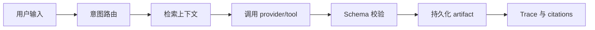

# LaserClaw 中文说明

LaserClaw 是一个面向激光实验工作流的本地优先 **Tool-calling RAG Agent** 工作台。它把实验 case 管理、全局知识库索引、RAG 检索增强问答、结构化 artifact 生成、citation 引用溯源和 Agent trace 执行链路追踪整合到一个应用里。

> 安全说明：LaserClaw 不控制激光器、电源、位移台、联锁、光学平台、探测器或任何实验室硬件。所有 AI 生成内容都只是辅助草稿，必须由具备资质的人员复核后才能用于真实实验。

## 解决的问题

| 问题 | LaserClaw 的处理方式 |
|---|---|
| 实验上下文分散在笔记、附件和历史运行记录中 | 基于 case 的 RAG 检索，并返回 source citation |
| 故障排查过程难以复现 | Tool-calling Agent 生成结构化诊断 artifact |
| 计划、报告、仿真草案重复劳动多 | 生成并保存 plan、troubleshooting、report、ReZonator draft |
| AI 输出难以审计 | 持久化 task、step、tool-call、citation 和 artifact 记录 |

## 核心能力

- **Case-aware Agent chat**：围绕当前实验 case、最近对话、case 数据和全局知识库进行问答。
- **RAG 知识库**：索引实验 case、文本附件、生成内容和全局实验文档。
- **全局知识源**：支持上传 PDF、TXT、Markdown、CSV、JSON、log 等共享文档，供所有 case 检索。
- **本地检索优化**：中文字符 n-gram、短语扩展、按 section 切块、section metadata，以及安全/光学主题的轻量 reranking。
- **Tool / Function Calling 路由**：自动区分普通问答、实验计划、故障排查、实验报告和 ReZonator 草案。
- **结构化输出**：对 plan、troubleshooting、report、resonator draft 的 JSON 结果做 schema 校验。
- **多模型 Provider**：支持 MockProvider、OpenAI-compatible Chat Completions Provider 和 Anthropic Provider。
- **可追踪性**：保存 Agent tasks、steps、tool calls、retrieved citations、generated contents 和 audit logs。
- **双语前端**：支持英文 / 中文 UI 切换。

## Agent 工作流



## 工具路由

当前支持五类用户意图：

| 用户意图 | Tool / mode |
|---|---|
| 普通聊天或问答 | `chat` |
| 生成实验计划 | `generate_plan` |
| 生成故障排查建议 | `generate_troubleshooting` |
| 生成实验报告 | `generate_report` |
| 生成 ReZonator / resonator 仿真草案 | `generate_resonator_draft` |

聊天接口可以自动路由生成类请求，也可以通过 `POST /api/agent/tasks` 直接创建 Agent task。

## RAG 与知识源

当前 RAG 检索是确定性的本地实现，不依赖向量数据库：

- tokenization：ASCII terms + 中文单字、bigram、trigram
- 对常见安全和光学术语做 synonym expansion
- 对 `[SAF-PPE]`、`[SAF-SOP]`、`[OPT-MIRROR]` 等标题做 section-aware chunking
- 在 chunk metadata 中保存 section 信息
- 对安全类和光学类 query 做轻量 domain boost

当前 synthetic evaluation documents：

- `synthetic_optical_components_catalog.pdf`：作为 PDF 全局知识源索引
- `lab_safety_manual.txt`：作为 TXT 全局知识源索引

这些文档是 **synthetic evaluation documents / 合成测试知识库**。它们不是真实实验室制度、操作规程、采购数据或安全培训材料。

## 最新本地评测

旧的 MockProvider / demo knowledge benchmark 已废弃。当前指标来自 OpenAIProvider 配置和 synthetic evaluation documents。

| 项目 | 数值 |
|---|---|
| Provider | OpenAIProvider |
| 配置模型 | `gpt-5` |
| 配置 Base URL | `https://openrouter.ai/api/v1` |
| RAG 检索 query 数量 | 50 |
| RAG 回答生成样本 | 之前完整评测中为 30 |
| 工具路由指令数量 | 80 |
| 结构化 artifact 生成次数 | 20 |
| 端到端 Agent task 数量 | 10 |
| 后端测试 | 120 passed |

| 指标 | 结果 |
|---|---:|
| RAG Top-1 hit rate | 95.45% |
| RAG Top-3 hit rate | 97.73% |
| RAG MRR | 0.9678 |
| Citation correctness | 82.00% |
| Tool routing accuracy | 80.00% |
| Schema pass rate | 100.00% |
| End-to-end task success rate | 100.00% |
| Trace completeness | 100.00% |

在同一套 50 条 synthetic benchmark 上，RAG 优化后 Top-3 hit rate 从 52.27% 提升到 97.73%。优化后的 10 条 RAG answer retest 曾尝试调用配置模型，但 OpenRouter 对 `gpt-5` 返回 `403: This model is not available in your region`，因此该轮回答生成结果不作为模型质量证据。

已知限制：

- 安全手册当前以 TXT 形式索引，不是 PDF source。
- 评测基于 synthetic documents，不代表真实实验室数据表现。
- 强化召回后，negative query rejection 从 100.00% 降到 83.33%，后续需要加入更明确的拒答阈值和 abstention 逻辑。
- 当前 provider wrapper 没有暴露 token usage 和 cost。
- 当前本地 lexical retriever 不能替代生产级 embedding 与 reranking。

## Windows 快速启动

```bat
Launch-LaserClaw.bat
```

启动脚本会：

- 创建 `backend/.venv`
- 安装后端依赖
- 安装前端依赖
- 启动 FastAPI：`127.0.0.1:8000`
- 启动 Vite：`127.0.0.1:5173`

访问地址：

- 前端：<http://127.0.0.1:5173>
- Agent 工作台：<http://127.0.0.1:5173/agent>
- API 文档：<http://127.0.0.1:8000/docs>

## 手动本地启动

后端：

```powershell
cd backend
.\.venv\Scripts\python.exe -m pip install -r requirements.txt
.\.venv\Scripts\python.exe -m uvicorn app.main:app --host 127.0.0.1 --port 8000
```

前端：

```powershell
cd frontend
npm install
npm run dev -- --host 127.0.0.1 --port 5173
```

## Docker Compose

```bash
docker compose up -d --build
```

服务地址：

- 前端：`localhost:5173`
- 后端 API：`localhost:8000`
- API 文档：`localhost:8000/docs`

停止：

```bash
docker compose down
```

## 环境变量

可以创建本地 `.env` 配置 Provider 和运行参数。不要提交 `.env` 或真实 API key。

```env
AI_PROVIDER=mock

OPENAI_API_KEY=
OPENAI_MODEL=gpt-5
OPENAI_BASE_URL=https://api.openai.com/v1

ANTHROPIC_API_KEY=
ANTHROPIC_MODEL=claude-sonnet-4-5
ANTHROPIC_MAX_TOKENS=2048
ANTHROPIC_TEMPERATURE=0.2

STRICT_PROVIDER=false
REQUIRE_AUTH=false
API_KEY=

DATABASE_URL=sqlite:///./laserclaw.db
UPLOAD_DIR=./uploads
MAX_UPLOAD_SIZE=10485760
AUTO_CREATE_TABLES=true

VITE_API_URL=http://127.0.0.1:8000
```

Provider 模式：

- `mock`：确定性的本地 demo 模式
- `openai`：OpenAI-compatible Chat Completions Provider
- `anthropic`：Anthropic Provider

当 `STRICT_PROVIDER=false` 时，真实 Provider 不可用时系统可以回退到 MockProvider。做严格评测时应使用 `STRICT_PROVIDER=true`。

## 测试

```powershell
cd backend
.\.venv\Scripts\python.exe -m pytest -q
```

当前本地结果：

```text
120 passed
```

常用定向测试：

```powershell
.\.venv\Scripts\python.exe -m pytest tests\test_router.py -q
.\.venv\Scripts\python.exe -m pytest tests\test_schemas.py -q
.\.venv\Scripts\python.exe -m pytest tests\test_knowledge_agent.py -q
```

## 主要 API

核心接口：

- `POST /api/cases`
- `GET /api/cases`
- `GET /api/cases/{case_id}`
- `POST /api/cases/{case_id}/generate-plan`
- `POST /api/cases/{case_id}/generate-troubleshooting`
- `POST /api/cases/{case_id}/generate-report`
- `POST /api/cases/{case_id}/generate-rezonator`
- `GET /api/cases/{case_id}/generated-contents`
- `POST /api/knowledge/sources/upload`
- `GET /api/knowledge/sources`
- `POST /api/knowledge/search`
- `POST /api/agent/chat`
- `POST /api/agent/tasks`
- `GET /api/agent/tasks/{task_id}`
- `GET /api/agent/tasks/{task_id}/tool-calls`

## 持久化数据

关键表：

- `experiment_cases`
- `attachments`
- `knowledge_sources`
- `knowledge_chunks`
- `retrieval_runs`
- `retrieval_results`
- `agent_chat_sessions`
- `agent_chat_messages`
- `agent_tasks`
- `agent_steps`
- `agent_tool_calls`
- `generated_contents`
- `audit_logs`

## 项目结构

```text
LaserClaw/
|-- backend/
|   |-- app/
|   |   |-- agent/        # routing, context, planner, orchestrator, tools
|   |   |-- api/          # FastAPI routes
|   |   |-- auth/         # optional API-key auth
|   |   |-- knowledge/    # ingestion, chunking, local embeddings, retrieval
|   |   |-- models/       # SQLAlchemy models
|   |   |-- observability/
|   |   |-- providers/    # Mock, OpenAI, Anthropic
|   |   `-- schemas/
|   |-- alembic/
|   |-- data/knowledge/   # synthetic/demo knowledge files
|   |-- tests/
|   `-- requirements.txt
|-- frontend/
|   |-- src/
|   |   |-- api/
|   |   |-- pages/
|   |   |-- LanguageContext.jsx
|   |   `-- i18n.js
|   `-- package.json
|-- Launch-LaserClaw.bat
|-- docker-compose.yml
|-- README.md
`-- READMEcn.md
```

## Roadmap

- 增加 calibrated no-answer threshold，改善 RAG 文档外问题拒答。
- 增加生产级 embedding provider 和 vector database 存储。
- 持久化 provider usage、token 和 cost 估算。
- 加强 section-level citation correctness 的 reranking。
- 增加可选 LangSmith 或 OpenTelemetry tracing。
- 使用有授权的真实实验室文档和人工标注 query 扩展 benchmark。

## 上传 GitHub 前检查

- 不提交 `.env`。
- 不提交真实 API key、截图、日志或包含密钥的文档。
- 不提交本地数据库文件，例如 `*.db`。
- 不提交 `backend/uploads/` 下的真实上传文件，除非明确是可公开的 synthetic/demo 文件。
- 推送前至少跑一次后端测试，必要时再跑前端 build。

## License

MIT License。详见 [LICENSE](LICENSE)。
